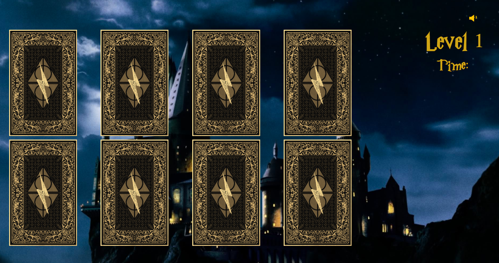

# Harry Potter Memory Game

A memory card game with three levels. Theme is Harry Potter.

## Purpose
A fully functional web based game developed with Javascript, jQuery, HTML, CSS and Bootstrap.

## Functionality

Markup has been styled to be responsive, according to the device used to view the app.

DRY, well-commented code, properly indented.

## Content
* Starting page
* 3 levels
* Animation page

## How to play
On the starting page select "Play" to start the game.
Choose a card and turn it over by clicking on it. Then select another card and turn it over.
If the two cards are a matching pair then they disappear. If not, they both turn back. Then you chose another card. The process continues until all cards on the board will be turned over.
After winning the first game, you will be directed to the next page where Harry gets one step closer to Hogwarts. Then you have to play two more rounds of memory game. Each winnings will move Harry further in his goal to reach Hogwarts. Getting to Hogwarts would mean the beginning of another long-waited year at Hogwarts which he calls home.

## Implementation

* HTML5
* CSS3
* Bootstrap 4.0
* JavaScript
* jQuery 3.3.1
* jQuery UI 1.12.1

## Issue - Fixed!
When clicking on a card before the previous animation had finished, the program stopped running. Fixed by disabling the clicks until the previous animation has finished with a setTimeout() function. 